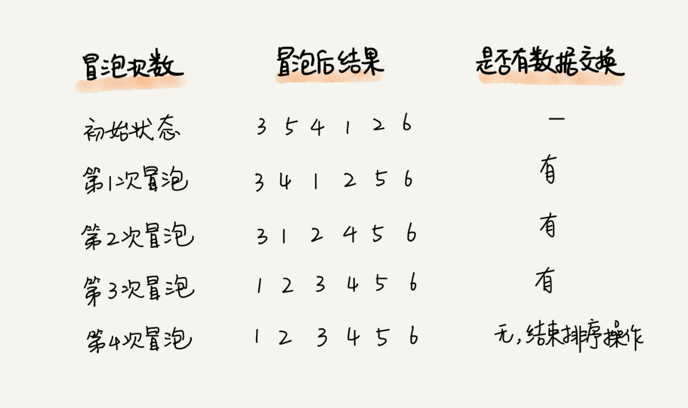

#排序


###分析一个排序算法  
####排序算法的执行效率  
1.最好情况，最坏情况，平均情况时间复杂度  
2.时间复杂度的系数，常数，低阶  
3.比较次数和交换（移动）的次数  
  
####排序算法的内存消耗
算法的内存消耗可以通过空间复杂度来衡量  
原地排序算法：指空间复杂度为O（1）的排序算法，包括冒泡，插入和选择  
   
####排序算法的稳定性
稳定性：待排序序列中存在值相等的序列，经过排序后，值相等的元素原有的先后顺序不变  

####冒泡排序  
冒泡排序只会操作相邻的两个数据。每次冒泡操作都会对相邻的两个元素进行比较，看是否满足大小关系要求。如果不满足就让它俩互换。一次冒泡会让至少一个元素移动到它应该在的位置，重复 n 次，就完成了 n 个数据的排序工作。  
过程：  

结果：  

优化：  
  
冒泡排序：  
 * 1.空间复杂度为 O(1)，是一个原地排序算法。
 * 2.是稳定的排序算法
 * 3.时间复杂度 最好O(n) 最坏O(n^2) 平均


```
通过“有序度”和“逆序度”这两个概念来进行分析时间复杂度  
有序度是数组中具有有序关系的元素对的个数。
有序元素对用数学表达式表示就是这样：有序元素对：a[i] <= a[j], 如果 i < j。

例如：
*对于一个倒序排列的数组，比如 6，5，4，3，2，1，有序度是 0；
*对于一个完全有序的数组，比如 1，2，3，4，5，6，有序度就是n*(n-1)/2，也就是 15。
我们把这种完全有序的数组的有序度叫作满有序度。

逆序度的定义正好跟有序度相反（默认从小到大为有序）
逆序元素对：a[i] > a[j], 如果 i < j。
逆序度 = 满有序度 - 有序度。我们排序的过程就是一种增加有序度，减少逆序度的过程，最后达到满有序度，就说明排序完成了。
要排序的数组的初始状态是 4，5，6，3，2，1 ，其中，有序元素对有 (4，5) (4，6)(5，6)，所以有序度是 3。
n=6，所以排序完成之后终态的满有序度为 n*(n-1)/2=15。
```
