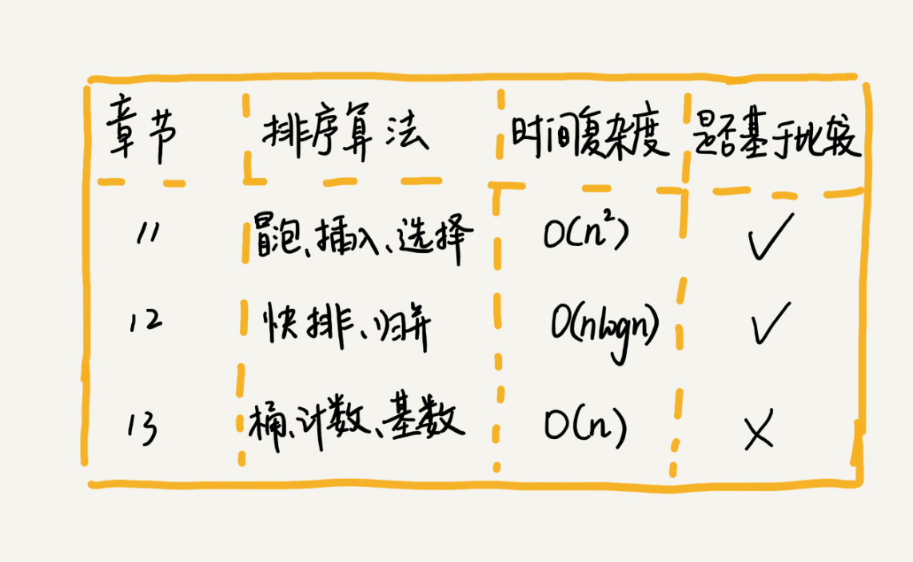
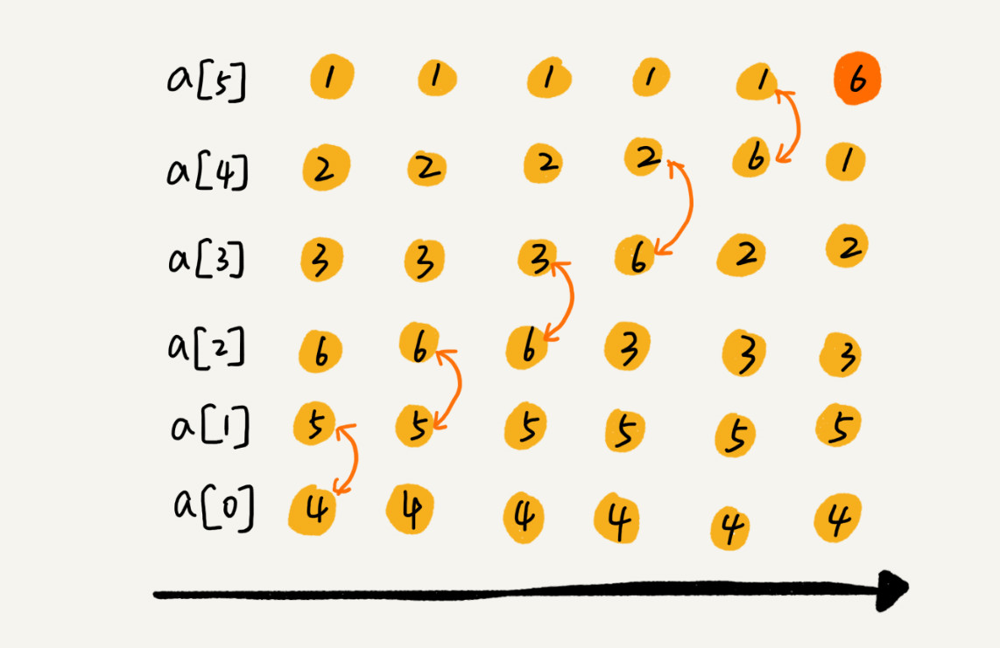

#排序

###分析一个排序算法  
####排序算法的执行效率  
1.最好情况，最坏情况，平均情况时间复杂度  
2.时间复杂度的系数，常数，低阶  
3.比较次数和交换（移动）的次数  
  
####排序算法的内存消耗
算法的内存消耗可以通过空间复杂度来衡量  
原地排序算法：指空间复杂度为O（1）的排序算法，包括冒泡，插入和选择  
   
####排序算法的稳定性
稳定性：待排序序列中存在值相等的序列，经过排序后，值相等的元素原有的先后顺序不变  

####冒泡排序  
冒泡排序只会操作相邻的两个数据。每次冒泡操作都会对相邻的两个元素进行比较，看是否满足大小关系要求。如果不满足就让它俩互换。一次冒泡会让至少一个元素移动到它应该在的位置，重复 n 次，就完成了 n 个数据的排序工作。  
过程：  

结果：  

